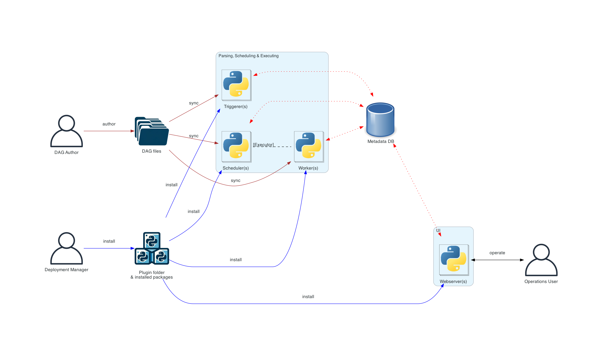
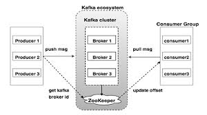

## Real-Time Data Streaming Project 

This guide provides a step-by-step approach to building a full-scale data engineering pipeline from scratch. It demonstrates how to handle data ingestion, processing, and storage using technologies such as Apache Airflow, Python, Apache Kafka, Apache Zookeeper, Apache Spark, and Cassandra. The entire setup is containerized using Docker for streamlined deployment and scalability.

## Key Learning Points 
As we systematically review the key concepts from this project, we will walk through the sequence in which data is processed within the system. Below is a rough diagram of the flow in which data is being processed: 

### Confluence

While not a part of this diagram, Confluence is important in keeping the Apache services together. 

**what is it**: It is a management and monitoring tool for Apache Kafka and related services in the Confluent ecosystem, provides a web based interface to observing and controlling kafka clusters, topics, streams, and connections. 

**what does it do**: It allows you to track and monitor the performance of Kafka brokers, topics, consumers, producers, schema registry, and connectors, among other Kafka-related components.

we can access this dashboard at `localhost:9021`.

**why do we use Confluence**: Simplifies the process of monitoring and managing Kafka. It does not control the orchestration or scheduling of workflows.

### Apache AirFlow

**what is it**: Apache Airflow provides the orchestration for the data pipeline, giving you a centralized interface to monitor and manage the flow of tasks (also known as DAGs). 

**what does it do**: It is used to schedule and monitor ETL pipelines, data workflows, and other batch or streaming tasks.

we can also access its own web-based UI via `localhost:8080` which allows users to manage tasks, monitor DAGs, view logs, and track status of individual tasks within the workflow. 

**why do we use AirFlow**: Helps in the automation and scheduling of complex workflows. It is often used to trigger tasks like data extraction, transformation, and loading (ETL processes).

**Components in Airflow**: 
* Tasks - individual pieces of work 
* Scheduler - schedules the workflows and submits tasks to the executor to run 
* Executor (part of the scheduler) - configuration property of the scheduler which specifies how the tasks should be runned. Here, we have used `SequentialExecutor`, which runs one task at a time and is ideal for development or small-scale environments
* webserver - presents a handy user interface to inspect, trigger and debug the behaviour of DAGs and tasks
* DAG files (`dags` file in this repository) - read by the scheduler to figure out what tasks to run and when to run them
* metadata database - Stores all the metadata for DAGs, task instances, logs, and configurations.

Below is an outline of the architecture used in this project. More about Airflow's architecture can be found [here](https://airflow.apache.org/docs/apache-airflow/stable/core-concepts/overview.html). 

In a large distributed system, there can be other roles that can be played, such as `Deployment Manager`, `DAG Author`, and `Operations User`, which plays a part in managing a larger system of machines. 

In the case of a distributed deployment, it is important to consider the security aspects of the components. The `webserver` does not have access to the DAG files directly. The code in the Code tab of the UI is read from the metadata database. The webserver cannot execute any code submitted by the DAG author. It can only execute code that is installed as an installed package or plugin by the Deployment Manager. The Operations User only has access to the UI and can only trigger DAGs and tasks, but cannot author DAGs.

* Deployment Manager: Responsible for deploying and maintaining Airflow infrastructure, ensuring that necessary packages and plugins are installed, and managing system-level configurations and security policies.
* DAG Author: Develops and writes DAGs to define workflows, ensuring they are correctly structured and meet the requirements for execution within the Airflow system.
* Operations User: Manages the execution of DAGs, monitors task status, triggers runs, and resolves issues, but does not have permissions to modify or create DAGs.

### Kafka

**what is Kafka**: Apache Kafka is a distributed event streaming platform capable of handling real-time data feeds, offering high throughput, scalability, and fault tolerance. It allows for the publishing, subscribing, storing, and processing of streams of records in a distributed system.

**what does Kafka do**: Kafka is used to stream data in real-time for event-driven architectures. It is commonly used for message queues, logging, monitoring, and real-time data pipelines.

You can interact with Kafka through its command-line interface (CLI) or through client libraries in languages like Java, Python, and more. Kafka also integrates with big data platforms like Apache Hadoop and Apache Spark.

**why do we use Kafka**: Kafka is designed for high-throughput, fault-tolerant, and low-latency data streaming. It is ideal for handling large volumes of real-time data, making it a great choice for applications that require fast processing and real-time analytics.

**Components in Kafka**: 
* Topic: A stream of messages that are a part of a specific category or feed name is referred to as a Kafka topic. In Kafka, data is stored in the form of topics. Producers write their data to topics, and consumers read the data from these topics.
* Broker: A Kafka cluster comprises one or more servers that are known as brokers. In Kafka, a broker works as a container that can hold multiple topics with different partitions. A unique integer ID is used to identify brokers in the Kafka cluster. Connection with any one of the kafka brokers in the cluster implies a connection with the whole cluster. If there is more than one broker in a cluster, the brokers need not contain the complete data associated with a particular topic.
* Consumers and Consumer Groups: Consumers read data from the Kafka cluster. The data to be read by the consumers has to be pulled from the broker when the consumer is ready to receive the message. A consumer group in Kafka refers to a number of consumers that pull data from the same topic or same set of topics.
* Producers: Producers in Kafka publish messages to one or more topics. They send data to the Kafka cluster. Whenever a Kafka producer publishes a message to Kafka, the broker receives the message and appends it to a particular partition. Producers are given a choice to publish messages to a partition of their choice.
* Partitions: Topics in Kafka are divided into a configurable number of parts, which are known as partitions. Partitions allow several consumers to read data from a particular topic in parallel. Partitions are separated in order. The number of partitions is specified when configuring a topic, but this number can be changed later on. The partitions comprising a topic are distributed across servers in the Kafka cluster. Each server in the cluster handles the data and requests for its share of partitions. Messages are sent to the broker along with a key. The key can be used to determine which partition that particular message will go to. All messages which have the same key go to the same partition. If the key is not specified, then the partition will be decided in a round-robin fashion.
* Partition Offset: Messages or records in Kafka are assigned to a partition. To specify the position of the records within the partition, each record is provided with an offset. A record can be uniquely identified within its partition using the offset value associated with it. A partition offset carries meaning only within that particular partition. Older records will have lower offset values since records are added to the ends of partitions.
* Replicas: Replicas are like backups for partitions in Kafka. They are used to ensure that there is no data loss in the event of a failure or a planned shutdown. Partitions of a topic are published across multiple servers in a Kafka cluster. Copies of the partition are known as Replicas.
* Leader and Follower: Every partition in Kafka will have one server that plays the role of a leader for that particular partition. The leader is responsible for performing all the read and write tasks for the partition. Each partition can have zero or more followers. The duty of the follower is to replicate the data of the leader. In the event of a failure in the leader for a particular partition, one of the follower nodes can take on the role of the leader.
* Zookeeper (older versions of kafka only): detects broker failures and coordinates leader elections in that instance. In more recent releases, Kafka has been transitioning to a KRaft mode (Kafka Raft), removing the need for Zookeeper for cluster metadata management and leader election.

#### Spark 
**What is Spark**: Apache Spark is an open-source, distributed computing system designed for fast, large-scale data processing. It provides a unified platform for batch and stream processing, offering high performance for both big data analytics and machine learning workloads.

**What does Spark do**: Spark is used for processing and analyzing large datasets quickly across multiple machines in a distributed system. It supports both batch processing (processing large volumes of data in chunks) and stream processing (handling real-time data streams). Spark can be used for tasks such as ETL (Extract, Transform, Load), data analysis, machine learning, graph processing, and real-time stream processing.

Spark provides APIs in multiple programming languages, including Scala, Java, Python, and R, and integrates with other big data technologies like Hadoop, Hive, and Kafka.

**Why do we use Spark**: Spark is designed for high-speed, fault-tolerant, and scalable data processing. It can handle massive amounts of data and provides in-memory processing, which speeds up analytics and machine learning tasks significantly. It’s a popular choice in big data ecosystems because it offers versatility (supporting both batch and stream processing) and a rich ecosystem for machine learning (MLlib), graph processing (GraphX), and SQL-based querying (Spark SQL).

**Components of Spark**: 
* Driver and Worker Nodes: The driver node coordinates job execution, while worker nodes execute tasks in parallel.
* Executors: Executors are responsible for executing tasks and storing the results in memory or disk.
* RDD, DataFrames, and Datasets: RDDs are the core data structure for distributed processing, while DataFrames and Datasets provide higher-level abstractions and optimizations.
* Partitioning: Data is split into partitions, allowing parallel processing across workers.
* Cluster Manager: Manages resources and allocates them across the driver and worker nodes.
* Stages and Jobs: Jobs are divided into stages and tasks for efficient distributed processing.
