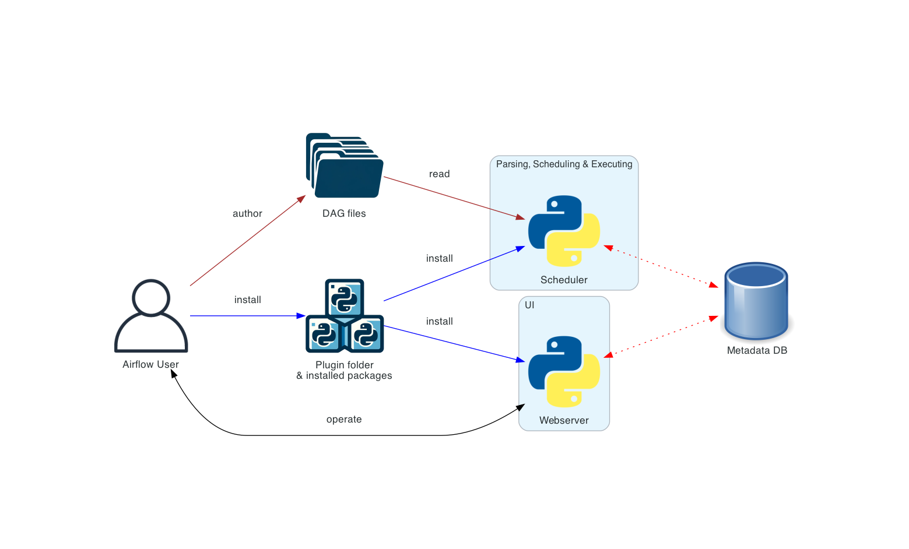
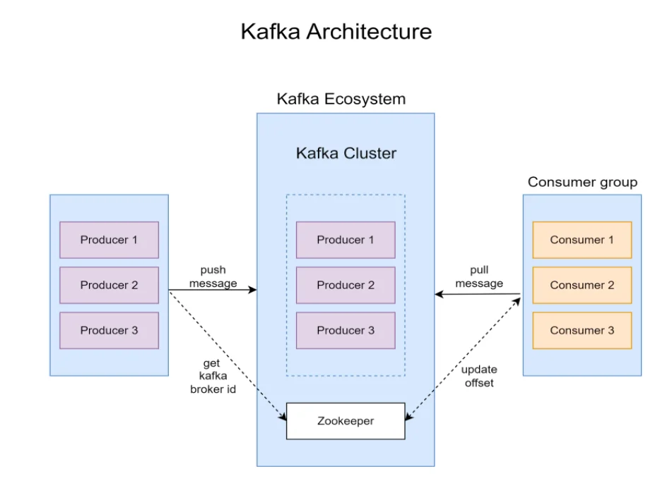
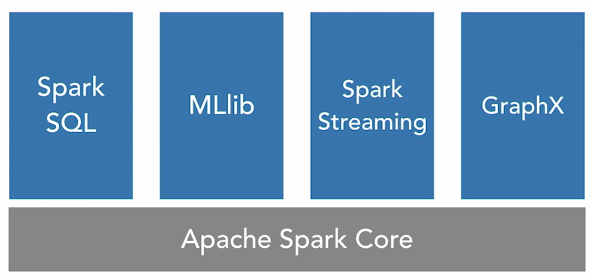
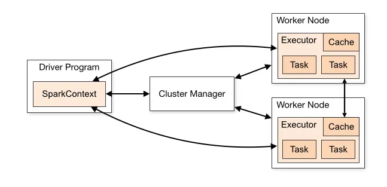

## Real-Time Data Streaming Project 

This guide provides a step-by-step approach to building a full-scale data engineering pipeline from scratch. It demonstrates how to handle data ingestion, processing, and storage using technologies such as Apache Airflow, Python, Apache Kafka, Apache Zookeeper, Apache Spark, and Cassandra. The entire setup is containerized using Docker for streamlined deployment and scalability.

## Key Learning Points 
As we systematically review the key concepts from this project, we will walk through the sequence in which data is processed within the system. Below is a rough diagram of the flow in which data is being processed: 


### Confluence

Confluence acts as a network for the various Apache services to communicate with each other.

**what is it**: It is a management and monitoring tool for Apache Kafka and related services in the Confluent ecosystem, provides a web based interface to observing and controlling kafka clusters, topics, streams, and connections. 

**what does it do**: It allows you to track and monitor the performance of Kafka brokers, topics, consumers, producers, schema registry, and connectors, among other Kafka-related components.

we can access this dashboard at `localhost:9021`.

**why do we use Confluence**: Simplifies the process of monitoring and managing Kafka. It does not control the orchestration or scheduling of workflows.

### Apache AirFlow

**what is it**: Apache Airflow provides the orchestration for the data pipeline, giving you a centralized interface to monitor and manage the flow of tasks (also known as DAGs). 

**what does it do**: It is used to schedule and monitor ETL pipelines, data workflows, and other batch or streaming tasks.

we can also access its own web-based UI via `localhost:8080` which allows users to manage tasks, monitor DAGs, view logs, and track status of individual tasks within the workflow. 

**why do we use AirFlow**: Helps in the automation and scheduling of complex workflows. It is often used to trigger tasks like data extraction, transformation, and loading (ETL processes).

**Components in Airflow**: 
* Tasks - individual pieces of work 
* Scheduler - schedules the workflows and submits tasks to the executor to run 
* Executor (part of the scheduler) - configuration property of the scheduler which specifies how the tasks should be runned. Here, we have used `SequentialExecutor`, which runs one task at a time and is ideal for development or small-scale environments
* webserver - presents a handy user interface to inspect, trigger and debug the behaviour of DAGs and tasks
* DAG files (`dags` file in this repository) - read by the scheduler to figure out what tasks to run and when to run them
* metadata database - Stores all the metadata for DAGs, task instances, logs, and configurations.

Below is an outline of the architecture used in this project. More about Airflow's architecture can be found [here](https://airflow.apache.org/docs/apache-airflow/stable/core-concepts/overview.html). 



In a large distributed system, there can be other roles that can be played, such as `Deployment Manager`, `DAG Author`, and `Operations User`, which plays a part in managing a larger system of machines. 

In the case of a distributed deployment, it is important to consider the security aspects of the components. The `webserver` does not have access to the DAG files directly. The code in the Code tab of the UI is read from the metadata database. The webserver cannot execute any code submitted by the DAG author. It can only execute code that is installed as an installed package or plugin by the Deployment Manager. The Operations User only has access to the UI and can only trigger DAGs and tasks, but cannot author DAGs.

* Deployment Manager: Responsible for deploying and maintaining Airflow infrastructure, ensuring that necessary packages and plugins are installed, and managing system-level configurations and security policies.
* DAG Author: Develops and writes DAGs to define workflows, ensuring they are correctly structured and meet the requirements for execution within the Airflow system.
* Operations User: Manages the execution of DAGs, monitors task status, triggers runs, and resolves issues, but does not have permissions to modify or create DAGs.


### Kafka

**what is Kafka**: Apache Kafka is a distributed event streaming platform capable of handling real-time data feeds, offering high throughput, scalability, and fault tolerance. It allows for the publishing, subscribing, storing, and processing of streams of records in a distributed system.

**what does Kafka do**: Kafka is used to stream data in real-time for event-driven architectures. It is commonly used for message queues, logging, monitoring, and real-time data pipelines.

You can interact with Kafka through its command-line interface (CLI) or through client libraries in languages like Java, Python, and more. Kafka also integrates with big data platforms like Apache Hadoop and Apache Spark.

**why do we use Kafka**: Kafka is designed for high-throughput, fault-tolerant, and low-latency data streaming. It is ideal for handling large volumes of real-time data, making it a great choice for applications that require fast processing and real-time analytics.

**Components in Kafka**: 
* Topic: A categorized stream of messages where producers write data, and consumers read it.
* Clusters and Brokers:  A Kafka cluster consists of brokers (servers) storing topics. Connecting to one broker links to the entire cluster. Brokers may not store all data for a topic.
* Consumers and Consumer Groups: Consumers pull data from brokers. Consumer groups allow multiple consumers to share topic data processing.
* Producers: Publish messages to topics and partitions. Messages can be routed to specific partitions using keys or via round-robin.
* Partitions: Topics are split into partitions for parallel processing. Each partition is ordered and distributed across brokers.
* Partition Offset: A unique identifier for a message's position within a partition, used for tracking and retrieval.
* Replicas and replication factor: Backup copies of partitions to ensure data availability during failures (specified with replication factor)
* Leader and Follower: Each partition has a leader (handles reads/writes) and followers (replicate data and take over if the leader fails).
* Zookeeper: Older versions used Zookeeper for broker failure detection and leader election. Newer versions use KRaft for these tasks.



#### Spark 
The information below is summarised from [Spark Architecture: A Deep Dive](https://medium.com/@amitjoshi7/spark-architecture-a-deep-dive-2480ef45f0be). Since I am very new to `Spark` as compared to `Kafka` and `Airflow`, I will be going in depth into its architecture here. 

**What is Spark**: Apache Spark is an open-source, distributed computing system designed for fast, large-scale data processing. It provides a unified platform for batch and stream processing, offering high performance for both big data analytics and machine learning workloads.

Spark uses modules such as `Spark SQL`, `MLlib`, `Spark Streaming` and `GraphX` that run on top of the core platform, that aids data processing. 



**Difference between Hadoop and Spark**: 
They have different use cases due to the nature of both big data frameworks: 

* Hadoop: better for cost-effective batch processing and long-term storage in distributed systems.
* Spark: best for applications requiring speed, iterative processing, or real-time data handling.

**What does Spark do**: Spark is used for processing and analyzing large datasets quickly across multiple machines in a distributed system. It supports both batch processing (processing large volumes of data in chunks) and stream processing (handling real-time data streams). Spark can be used for tasks such as ETL (Extract, Transform, Load), data analysis, machine learning, graph processing, and real-time stream processing.

Spark provides APIs in multiple programming languages, including Scala, Java, Python, and R, and integrates with other big data technologies like Hadoop, Hive, and Kafka.

**Why do we use Spark**: Spark is designed for high-speed, fault-tolerant, and scalable data processing. It can handle massive amounts of data and provides in-memory processing, which speeds up analytics and machine learning tasks significantly. It’s a popular choice in big data ecosystems because it offers versatility (supporting both batch and stream processing) and a rich ecosystem for machine learning (MLlib), graph processing (GraphX), and SQL-based querying (Spark SQL).

**Components of Spark**: 
* Drive node: program or process responsible for coordinating the execution of the Spark application. It runs the main function and creates the SparkContext, which connects to the cluster manager. The Spark Driver includes several other components, including a DAG Scheduler, Task Scheduler, Backend Scheduler, and Block Manager, all of which are responsible for translating user-written code into jobs that are actually executed on the cluster. 
* sparkContext: SparkContext is the entry point for any Spark functionality. It represents the connection to a Spark cluster and can be used to create RDDs (Resilient Distributed Datasets), accumulators, and broadcast variables. SparkContext also coordinates the execution of tasks.
* Worker node and Executor: Executors are worker processes responsible for executing tasks in Spark applications. They are launched on worker nodes and communicate with the driver program and cluster manager. Executors run tasks concurrently and store data in memory or disk for caching and intermediate storage.
* Cluster Manager: responsible for allocating resources and managing the cluster on which the Spark application runs. Spark supports various cluster managers like Apache Mesos, Hadoop YARN, and standalone cluster manager.



**2 Main Abstractions**:
Apache Spark has a well-defined layer architecture that is designed on two main abstractions:

1. Resilient Distributed Dataset (RDD): RDD is an immutable (read-only), fundamental collection of elements or items that can be operated on many devices at the same time (spark parallel processing). Each dataset in an RDD can be divided into logical portions, which are then executed on different nodes of a cluster.
2. Directed Acyclic Graph (DAG): DAG is the scheduling layer of the Apache Spark architecture that implements stage-oriented scheduling. Compared to MapReduce which creates a graph in two stages, Map and Reduce, Apache Spark can create DAGs that contain many stages.

**Cluster Manager Types** 
The system currently supports several cluster managers:

* Standalone — a simple cluster manager included with Spark that makes it easy to set up a cluster.
* Apache Mesos — a general cluster manager that can also run Hadoop MapReduce and service applications.
* Hadoop YARN — the resource manager in Hadoop 2.
* Kubernetes — an open-source system for automating deployment, scaling, and management of containerized applications.

**Execution Modes**
1. Cluster mode (used in this project)
In cluster mode, a user submits a pre-compiled JAR, Python script, or R script to a cluster manager. The cluster manager then launches the driver process on a worker node inside the cluster, in addition to the executor processes. This means that the cluster manager is responsible for maintaining all Spark Application–related processes.

2. Client mode
Client mode is nearly the same as cluster mode except that the Spark driver remains on the client machine that submitted the application. This means that the client machine is responsible for maintaining the Spark driver process, and the cluster manager maintains the executor processes.

3. Local mode
Local mode is a significant departure from the previous two modes: it runs the entire Spark Application on a single machine. It achieves parallelism through threads on that single machine. This is a common way to learn Spark, test your applications, or experiment iteratively with local development.

#### Set-up and Installation

1. Clone the repository:

```
git clone https://github.com/airscholar/e2e-data-engineering.git
```

2. Navigate to the project directory and open up the 

```
cd e2e-data-engineering
```

3. Run Docker Compose to spin up the services:
```
docker-compose up
```